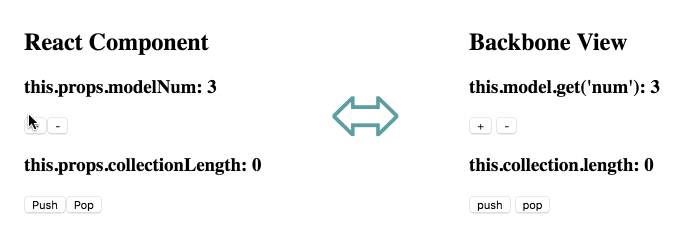

Sample code showing a Backbone View and a React component connected to the same Backbone model and collection.

## Running it locally

- From the _samples/_ directory, run `npm start`
- Open http://localhost:3000 to view it in the browser.

